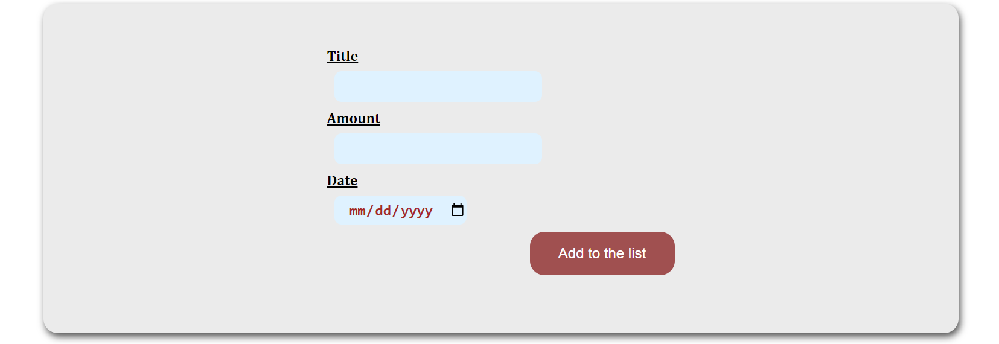
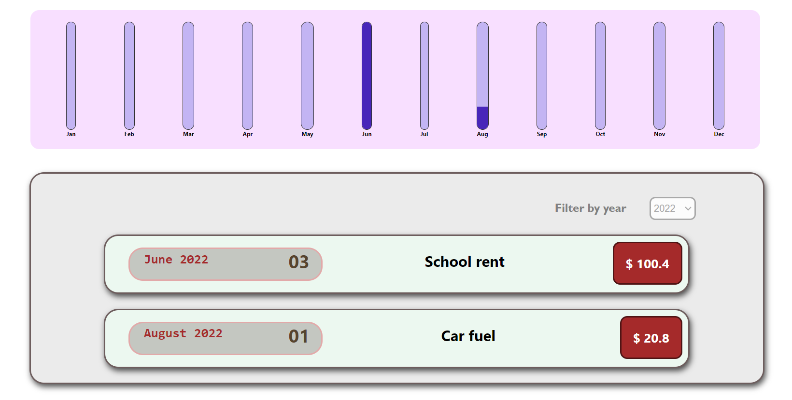

# Expense List - React App

This is a simple expense list application built with React. It allows users to track their expenses by adding to the list. The application provides a clean and intuitive user interface for managing expenses effectively.




## Features

- Add new expenses with details such as description, amount, and date.
- View a summary of total expenses.

## Technologies Used

The application is built using the following technologies:

- React
- JavaScript
- HTML
- CSS

## Getting Started

Follow the steps below to set up and run the Expense List app locally:

1. Clone the repository to your local machine:

   ```bash
   git clone git clone https://github.com/Lykamopia/Expense-List-App-React-App.git
   ```

2. Navigate to the project directory:

   ```bash
   cd Expense-List-App-React-App
   ```

3. Install the dependencies using a package manager such as npm or yarn:

   ```bash
   npm install
   ```

4. Start the development server:

   ```bash
   npm start
   ```

5. Open a web browser and visit `http://localhost:3000` to view the application.

## Usage

- To add a new expense,Fill in the required details in the form thenclick on the "Add To List" button.
- The total expenses are displayed at the bottom of the list.

## Contributing

Contributions are welcome! If you encounter any issues or have suggestions for improvements, please feel free to open an issue or submit a pull request.
## Acknowledgements

- The Expense List app was developed using React, a powerful JavaScript library for building user interfaces.
- The project structure and setup were inspired by popular React starter kits and best practices.

## Contact

If you have any questions or want to connect, you can reach me at [your-email@example.com](mailto:www.alex94lykam@gmail.com).

Thank you for using the Expense List app!

Happy budgeting!
